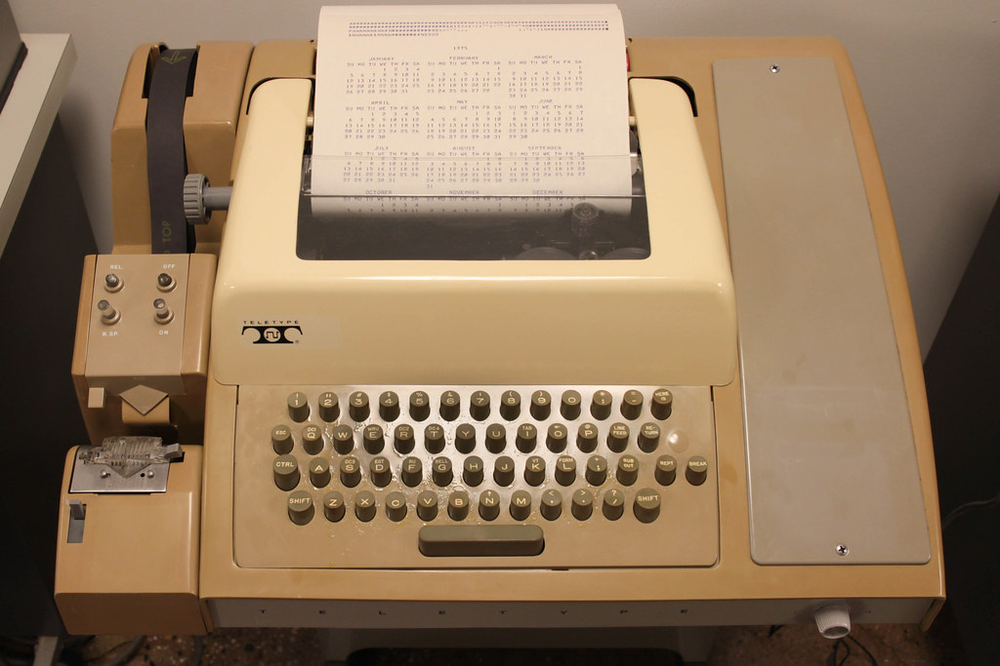

# Terminal

## 早期终端

<div align="left">

<figure><figcaption><p>IBM 2260</p></figcaption></figure>

</div>

早期的终端是一种独立的硬件设备，用于连接到主计算机或服务器。它们通常包括：

* **输入设备**：如键盘，用于输入命令和数据。
* **输出设备**：如显示器或打印机，用于显示计算结果和系统反馈。

例如：早期的 Teletype (tty) 终端、DEC VT100 终端。

## 现代终端

<div align="left">

<figure><figcaption><p>iTerm2</p></figcaption></figure>

</div>

现代终端更多是以软件形式存在的，即终端模拟器（Terminal Emulator），它们在现代操作系统（如Linux、macOS、Windows）中作为应用程序运行，模拟早期硬件终端的功能。

## 常见的终端模拟器

1. **GNOME Terminal**：常见于 Linux 系统的默认终端模拟器，功能强大且易于使用。
2. **iTerm2**：macOS 系统上的高级终端模拟器，提供了丰富的功能，如分屏、标签页、搜索等。
3. **Windows Terminal**：Windows 系统上的现代终端模拟器，支持多个命令行环境，如 PowerShell、CMD、WSL。
4. **PuTTY**：Windows 系统上广泛使用的 SSH 客户端，适用于远程连接和管理。

## Teletype

<div align="left">

<figure><figcaption><p>Teletype Model 33</p></figcaption></figure>

</div>

虽然 Teletype 设备现在已经不再使用了，但它的概念和功能依然保留在 Linux 中。

### /dev/tty

可以看到它的文件类型是 `c`（字符设备），代表当前进程所连接的终端设备。

```
crw-rw-rw- 1 root tty 5, 0 Aug  3 17:17 /dev/tty
```

它的权限是 `666`，设备号是 `0`，这就是我们常常看到的标准输入/输出。

```
echo "Hello, World" > /dev/tty
```

```
read -p "Enter your name: " name < /dev/tty
echo "Hello, $name"
```

### /dev/pts

PTS 是伪终端的简写（Pseudo-Terminal），`/dev/pts` 是一个目录，用于存放伪终端设备文件。

```
ll /dev/pts
```

```
crw--w---- 1 root tty  136, 0 Aug  4 10:59 0
c--------- 1 root root   5, 2 Jul 19 15:10 ptmx
```

列出 `/dev/pts` 目录的文件，一般情况下会看到两类文件。

* ptmx：Master Device，主设备，用于创建和管理伪终端对。
* 0/1/2：Slave Device，从设备，每一个 `ssh` 会话对应一个数字。

在命令行输入 tty 命令可以看到当前连接的伪终端设备文件。

```
$ tty
/dev/pts/0
```

```
$ man tty
tty - print the file name of the terminal connected to standard input
```

### 查看当前登录的用户

最常用的方法是 `w` 命令。

```
$ w
 11:18:19 up 15 days, 20:08,  2 users,  load average: 0.00, 0.01, 0.05
USER     TTY      FROM             LOGIN@   IDLE   JCPU   PCPU WHAT
root     pts/0    120.231.138.130  10:59    3.00s  0.02s  0.00s w
root     pts/1    120.231.138.130  11:11    6:41   0.01s  0.01s -bash
```

还可以使用 `who` 命令。

```
$ who
root     pts/0        2024-08-04 10:59 (120.231.138.130)
root     pts/1        2024-08-04 11:11 (120.231.138.130)
```

当然你要直接用 `ls` 也行。

```
$ ls -l
crw--w---- 1 root tty  136, 0 Aug  4  2024 0
crw--w---- 1 root tty  136, 1 Aug  4 11:11 1
c--------- 1 root root   5, 2 Jul 19 15:10 ptmx
```

### 给特定 PTS 发送消息

```
echo "hello, world" > /dev/pts/1
```

### 强制退出特定 PTS

```
ps -t /dev/pts/1
```

```
kill -9 PID
```
